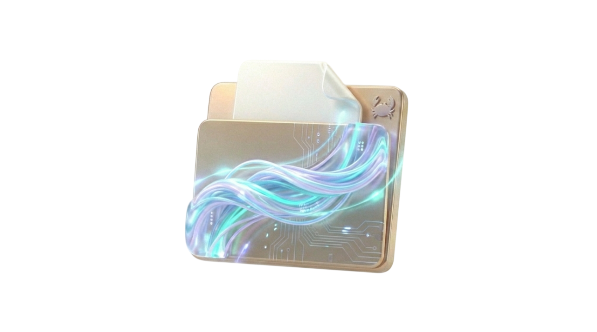

<div align="center">

  
  
  <h1>oxidrop</h1>
  
  <p>
    <b>Bridging the Gap Between Your Desk and Your Devices</b>
  </p>


</div>


Oxidrop is a localized, lightning-fast file synchronization and streaming service designed to bridge the gap between your Linux workstation and remote devices (like an iPad/iPhone). It bypasses third-party cloud providers and network restrictions by serving files directly from your local hardware.


## Architecture

The system is built on a modern asynchronous stack:

*   **Configuration Engine (`config.rs`)**: Centralizes application settings, handles environment variables via `dotenvy`, and implements "Fail Fast" logic to ensure secure and robust startup.
*   **Storage Manager (`storage.rs`)**: Manages the local filesystem interface, ensuring the storage directory exists and is accessible.
*   **Axum Gateway (`server/mod.rs`)**: The core async server that binds to `0.0.0.0` to accept connections from local and external devices (e.g., via mobile hotspot).

## Technical Deep Dive: Why Rust & Axum?

*   **The Power of `.await`**: Utilizing the **Tokio** runtime and **Axum**, Oxidrop uses a non-blocking asynchronous model. This allows the server to handle thousands of concurrent connections efficiently without stalling on I/O operations.
*   **Type Safety**: Rust's strict type system guarantees memory safety and prevents common bugs like null pointer exceptions and data races at compile time.

## Roadmap

The project development is divided into four phases:

### Phase 1: The Gateway (Complete) ✅
*   Established Rust project structure and Tokio runtime.
*   Implemented basic HTTP routing with Axum.
*   Network firewall traversal (UFW/Hotspot).

### Phase 2: The Explorer (Current) 🚧
*   **Goal**: Enable remote viewing of the host's filesystem.
*   **Key Tasks**: Shared state implementation (`Arc<Config>`), safe directory reading, metadata extraction, and JSON serialization.

### Phase 3: The Vault
*   **Goal**: Security and Authentication.
*   **Key Tasks**: Basic Auth middleware, optimized file streaming, and HTTP Range requests for video seeking.

### Phase 4: The Sync
*   **Goal**: Two-way synchronization.
*   **Key Tasks**: File upload (`POST`), Multipart handling, and WebDAV support.

## Getting Started

### Prerequisites
*   **Rust**: Ensure you have Rust and Cargo installed.

### Setup

1.  **Clone the repository**
2.  **Environment Setup**:
    Copy the example environment file and configure it:
    ```bash
    cp .env.example .env
    ```
    Edit `.env` to set your desired `PORT`, `HOST_ADDR` (usually `0.0.0.0` for external access), and `STORAGE_PATH`.

3.  **Create Storage Directory**:
    Ensure the path defined in `STORAGE_PATH` exists.
    ```bash
    mkdir -p /home/user/oxidropStorage/ # Replace with your actual path
    ```

4.  **Run**:
    ```bash
    cargo run
    ```
