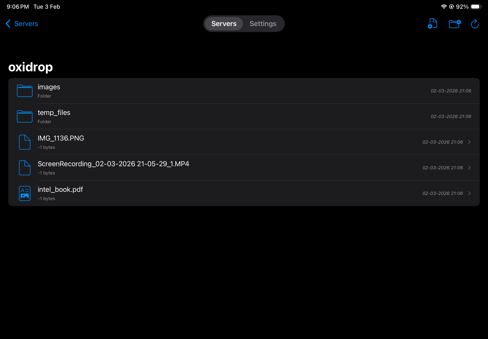
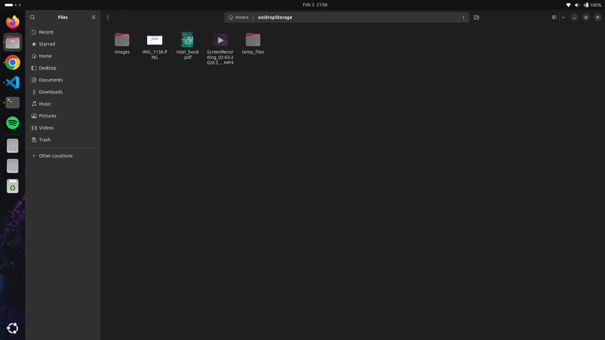

<div align="center">

  
  
  <h1>oxidrop</h1>
  
  <p>
    <b>Bridging the Gap Between Your Desk and Your Devices</b>
  </p>


</div>

## What is Oxidrop?

Oxidrop is a fast, local file server that lets you access your Linux files from your iPad/iPhone over your local network or mobile hotspot. No cloud needed—your files stay private and under your control.

## What Problem Does It Solve?

- **No Cloud Dependency**: Direct access to your files without third-party services
- **Network Freedom**: Works over WiFi, mobile hotspot, or any local network
- **Privacy First**: Your files never leave your device
- **Fast**: Built with Rust for high-performance file streaming

## Demo
Some screenshots and videos that demonstrate the usage of oxidrop  

<div style="display: flex; justify-content: space-around; align-items: center;">
  
  
</div>

## Installation

### 1. Download & Extract

Download the latest release from [GitHub Releases](https://github.com/dhruvkshah75/oxidrop/releases):

```bash
tar -xzf oxidrop-linux-x86_64.tar.gz
cd oxidrop
```

### 2. Run Setup Script

```bash
chmod +x setup.sh  # give the permission to execute 
./setup.sh
```

This will prompt you for:
- Port (default: 9090)
- Storage path (default: /home/user/oxidrop-storage)
- Username
- Password

### 3. Start the Server

```bash
./oxidrop
```

## Connecting from iPad/iPhone

### 1. Install WebDAV Nav

Download **WebDAV Nav** from the App Store or **OwlFiles** from the playstore

### 2. Connect to Server

1. Open WebDAV Navigator
2. Tap "+" to add a new connection
3. Enter your connection details:
   - **URL**: `http://oxidrop.local:<port>/`  (default: `http://oxidrop.local:9090/`)
   - **Username**: The username you set during setup
   - **Password**: The password you set during setup
4. **Disable Secure Connection** 
5. Tap "Save"


